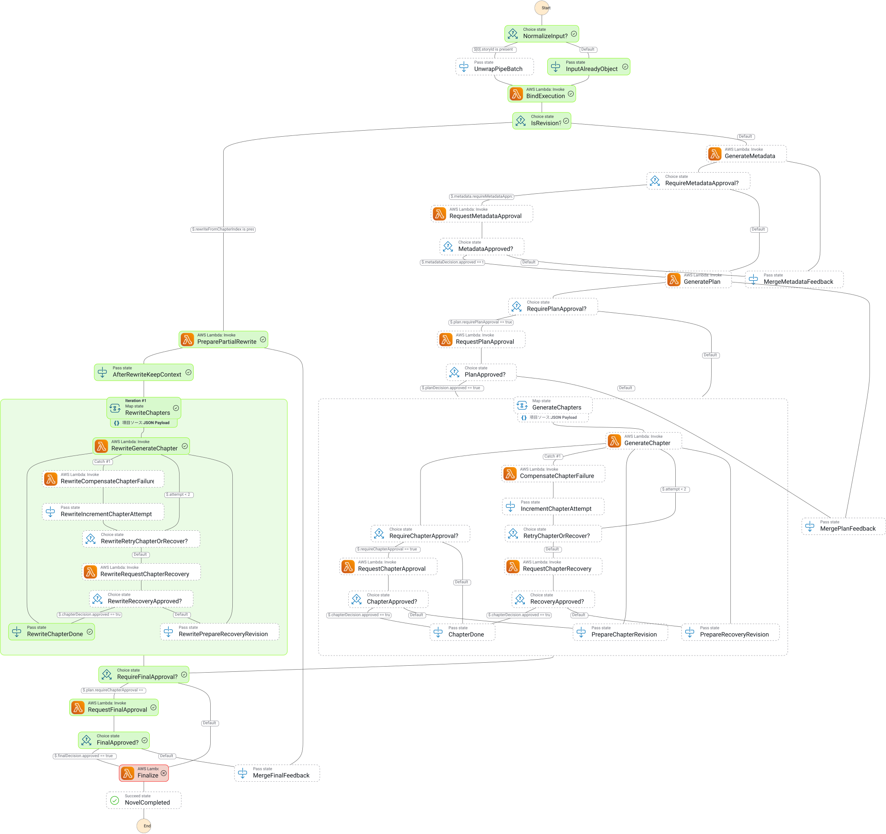

# novel-generator

AWS 上で短編〜中編の日本語小説を生成するサーバーレスワークフローです。

ユーザーが概要・テーマ・登場人物などのシードを送ると、設定書（メタデータ）→ プラン → 章本文 → 最終原稿までを StepFunctions がオーケストレーションします。各段階で承認ゲートを挟めます（スキップも可能）。承認処理はStepFunctionsのWaitForTaskTokenを利用しています。(各トークンはDynamoDBのStoryレコードに記録されるため、ユーザーはレコードのidのみを知っていれば、ワークフロー再開のためのAPIを叩けます)

## Architecture

```
ブラウザ → CloudFront → S3（Reactの静的ホスティング）
   │
   └─ fetch (CORS) → HTTP API  →  SQS  →  EventBridge Pipe  →  Step Functions
                                                            │
                                   ┌────────────────────────┼────────────────────────┐
                                   ▼                        ▼                        ▼
                             Bedrock (生成)           DynamoDB (状態)            S3 (本文)
                                   │
                                   └─ SES（完成通知・承認待ち通知）
```

主なコンストラクト:

| Construct | 役割 |
|---|---|
| `NovelStorage` | DynamoDB（Story / Plan / Chapter / TKG、および利用コスト集計用のUsageTable）と S3（章・最終本文） |
| `NovelAuth` | Cognito User Pool + User Pool Client（メール+パスワードのセルフサインアップ） |
| `NovelWorkflow` | Step Functions + 生成・承認・Finalize 用 Lambda |
| `NovelIngestion` | 投稿キュー（SQS）と Pipe |
| `NovelApi` | HTTP API（投稿・状態取得・承認・改訂。全ルートに Cognito JWT Authorizer を適用） |
| `NovelFrontend` | React SPA を配信する S3（非公開バケット）+ CloudFront |

### Step Functions workflow

ステートマシン全体図（AWS コンソールからエクスポートした画像を配置予定）:



おおまかな流れ:

1. **BindExecution** … 実行 ARN をロック
2. **GenerateMetadata** … 設定書生成 →（任意）メタデータ承認
3. **GeneratePlan** … 章構成生成 →（任意）プラン承認
    4. **GenerateChapters (Map)** … 章本文生成・事実抽出・未来プラン再整合 →（任意）章承認。生成が2回失敗すると章の再生成指示待ち（通常の章承認とは別UI）に入る

5. **Final approval / Finalize** …（任意）最終承認のあと本文連結・通知
6. **Revision path** … 最終拒否や `POST .../revisions` から指定章以降を部分再生成

承認フラグ（`POST /stories`）:

| フラグ | 省略時デフォルト |
|---|---|
| `requireMetadataApproval` | `true` |
| `requirePlanApproval` | `true` |
| `requireChapterApproval` | `false` |
| `requireFinalApproval` | `!requireChapterApproval`（従来の「章オフ＝最終オン」を維持） |

評価バッチなどで無承認完走する場合は、4 つとも `false` を明示します。

## API (overview)

すべてのルートは Cognito の JWT Authorizer で保護されています。呼び出し側は `Authorization: Bearer <idToken>`
ヘッダーを付与する必要があります（フロントエンドは `AuthContext` が自動的に付与します）。

| Method | Path | 説明 |
|---|---|---|
| `POST` | `/stories` | 物語を投稿しワークフロー開始（呼び出し元ユーザーが所有者になる） |
| `GET` | `/me/stories` | ログイン中ユーザーが所有する物語の一覧（マイストーリー） |
| `GET` | `/stories/{storyId}` | 進行状況・設定書・プラン・章一覧（所有者のみ） |
| `GET` | `/stories/{storyId}/chapters/{chapterIndex}/content` | 章本文と署名付き URL（所有者のみ） |
| `GET` | `/stories/{storyId}/final/content` | 完成原稿の署名付き URL（都度再発行。所有者のみ） |
| `POST` | `/stories/{storyId}/metadata/decision` | 設定書の承認/拒否（所有者のみ） |
| `POST` | `/stories/{storyId}/plan/decision` | プランの承認/拒否（所有者のみ） |
| `POST` | `/stories/{storyId}/chapters/{chapterIndex}/decision` | 章の承認/拒否（所有者のみ） |
| `POST` | `/stories/{storyId}/final/decision` | 最終原稿の承認/拒否（所有者のみ） |
| `POST` | `/stories/{storyId}/revisions` | 指定章以降の部分再生成を開始（所有者のみ） |

`POST /stories` の主なボディ（`userEmail` は不要。JWT の `email` クレームから取得します）:

```json
{
  "overview": "孤島の灯台守が嵐の夜に漂流者を拾う",
  "theme": "孤独と赦し",
  "characters": "灯台守・アキラ、漂流者・ユキ",
  "tone": "静謐で少し不気味",
  "setting": "孤島の灯台",
  "length": "short",
  "requireMetadataApproval": true,
  "requirePlanApproval": true,
  "requireChapterApproval": false,
  "requireFinalApproval": true
}
```

`length` は `short`（既定）または `medium` です。

## 認証・所有者チェック

Story の所有権は Cognito でログインしたユーザー単位で管理します。

- **ユーザープール**: `NovelAuth` コンストラクトが Cognito User Pool と User Pool Client を作成します。
  サインアップはメールアドレス＋パスワードのセルフサインアップ（メール確認コードによる本人確認あり）で、
  管理者による招待やソーシャルログインは使いません。
- **API 保護**: `NovelApi` の全ルートに `HttpUserPoolAuthorizer` を適用しています。フロントエンドは
  サインイン時に取得した ID トークンを `Authorization: Bearer <idToken>` として各リクエストに付与します。
- **所有者チェック**: `POST /stories` で物語を投稿すると、JWT の `sub` クレームが `ownerId` として
  `Story` に記録されます。以降、状態取得・章本文取得・最終原稿取得・各種承認/拒否・改訂開始のいずれも、
  呼び出し元の `sub` が `Story.ownerId` と一致しない場合はドメイン層の `assertOwnedBy` が
  `ForbiddenError`（HTTP `403 Forbidden`）を返します。承認リンク（メール内のURL）はcapability tokenとして
  機能しますが、開くには対象ユーザーとしてログインしている必要があります。
- **マイストーリー**: `GET /me/stories` は `ownerId`（DynamoDBの`StoryTable`に追加した`OwnerIndex` GSI、
  `ownerId` + `createdAt`）で自分が投稿した物語を新しい順に一覧取得します。
- 開発フェーズであることを踏まえ、既存の（認証前に発行された）ステータスページ・承認リンクとの
  後方互換性は維持していません。

## 利用コスト管理（プラン別の月次予算）

`ownerId`（ログインユーザーの`sub`）に紐づく `userEmail`（JWT の `email` クレーム）をアカウントキーとして、
Bedrock呼び出しの実コストを月単位で集計し、プランごとの予算上限に達したら新規の生成開始を拒否します。

- **記録**: `GenerateMetadata` / `GeneratePlan` / `GenerateChapter` の各Lambdaが、Bedrock呼び出し1回ごとに
  入力・出力トークン数から実コスト（USD）を計算し、`UsageTable`（PK=`accountEmail` / SK=`MONTHLY#<yyyy-MM>`）に
  加算記録します。記録はベストエフォートで、失敗しても生成処理自体は止めません（SES送信失敗時の既存方針と同様）。
  モデル別価格は [`src/domain/value-objects/BedrockPricing.ts`](src/domain/value-objects/BedrockPricing.ts) に集約しています。
- **判定**: `POST /stories`（新規投稿）・`POST /stories/{storyId}/revisions`（改訂開始）・各種 `.../decision`
  （承認/拒否。いずれも次工程の追加生成につながるため）の直前に、当月コストがプラン上限以上なら
  `402 Payment Required` を返し、そこで停止します。すでに実行中のワークフロー内部（章の自動生成ループなど）
  までは遮断しません。
- **プラン**: `free`（既定、$2/月）と `pro`（$30/月）を [`src/domain/value-objects/UsagePlan.ts`](src/domain/value-objects/UsagePlan.ts) で定義しています。
  決済連携は未実装のため、`pro`への昇格は運用者が`UsageTable`に `PK=accountEmail, SK=PROFILE, planTier=pro` の
  レコードを直接投入することで行います（次段のスコープ）。

## Prerequisites

- Node.js 20.18+ と npm
- AWS CDK CLI（`npx cdk` で可）
- デプロイ先アカウントで Bedrock モデルアクセスが有効であること
- 完成メールを送る場合は SES で検証済みの送信元アドレス

## Setup / Deploy

```bash
npm ci
npm test
npx cdk synth
NOTIFICATION_FROM_ADDRESS=you@example.com 
npx cdk deploy
```

`cdk deploy`（および`cdk synth`）は`frontend/dist`が存在することを前提に`NovelFrontend`コンストラクトを
組み立てます。`npm run deploy` / `npm run synth` を使うと、Reactアプリのビルド（`frontend/`で`npm ci && npm run build`）
を自動的に先行実行します。直接`cdk deploy`を叩く場合は事前に `npm run build:frontend` を実行してください。

環境変数でも上書きできます。

| 変数 | 用途 |
|---|---|
| `BEDROCK_MODEL_ID` | Converse に渡す推論プロファイル ID |
| `NOTIFICATION_FROM_ADDRESS` | SES 送信元 |
| `CDK_DEFAULT_REGION` / `CDK_DEFAULT_ACCOUNT` | デプロイ先（任意） |

デプロイ後、スタック出力の `ApiUrl`・`FrontendUrl`・`StateMachineArn`・`UsageTableName`・
`UserPoolId`・`UserPoolClientId` を控えてください。
`FrontendUrl`（CloudFrontのドメイン）がReactフロントエンドの公開URLです。フロントエンドは
`apiBaseUrl`・`cognitoUserPoolId`・`cognitoUserPoolClientId`を含む`config.json`をデプロイ時に
ランタイム設定として自動生成するため、これらの値が変わってもフロントエンドの再ビルドは不要です
（`cdk deploy`の再実行だけで反映されます）。

## Evaluation seeds

品質評価用の第1ラウンドシードと投入スクリプトがあります。

- [`eval/round1-seeds.json`](eval/round1-seeds.json) … short×8 + medium×2、全承認オフ
- [`eval/submit-round1.ts`](eval/submit-round1.ts) … `POST /stories` 一括投入

```bash
# 送信内容の確認のみ
DRY_RUN=1 npx ts-node eval/submit-round1.ts

# 実投入（デプロイ済み API と、ログイン済みユーザーの Cognito ID トークンが必要）
API_BASE_URL=https://xxxx.execute-api.ap-northeast-1.amazonaws.com \
EVAL_ID_TOKEN=eyJraWQi... \
npx ts-node eval/submit-round1.ts
```

## Project layout

```
bin/                 CDK アプリエントリ
lib/                 CDK スタック / コンストラクト（Frontend含む）
frontend/            React フロントエンド（Vite、独立したnpmパッケージ）
src/application/     ユースケースとポート
src/domain/          ドメインモデル
src/infrastructure/  AWS SDK アダプタ（Bedrock / DynamoDB / S3 / SES / SFN / SQS）
src/interface/       Lambda ハンドラと DI コンテナ
eval/                評価用シードと投入スクリプト
docs/images/         アーキテクチャ図・ワークフロー図
test/                Jest テスト
```

## Useful commands

* `npm run build` — TypeScript コンパイル
* `npm run watch` — 変更監視コンパイル
* `npm test` — Jest
* `npm run build:frontend` — `frontend/`の依存インストール + Reactアプリのビルド
* `npm run synth` — フロントエンドをビルドしてから `cdk synth`
* `npm run deploy` — フロントエンドをビルドしてから `cdk deploy`
* `npx cdk diff` — 差分確認

フロントエンド単体の開発コマンド（`npm run dev`・`npm run test`・`npm run lint`）は
[`frontend/README.md`](frontend/README.md) を参照してください。

## Samples

生成結果のサンプルは [`docs/samples/hard-sf/`](docs/samples/hard-sf/) にあります。
（`seed.json` / `generated_metadata.json` / `generated_plan.json` / `manuscript.txt`）

